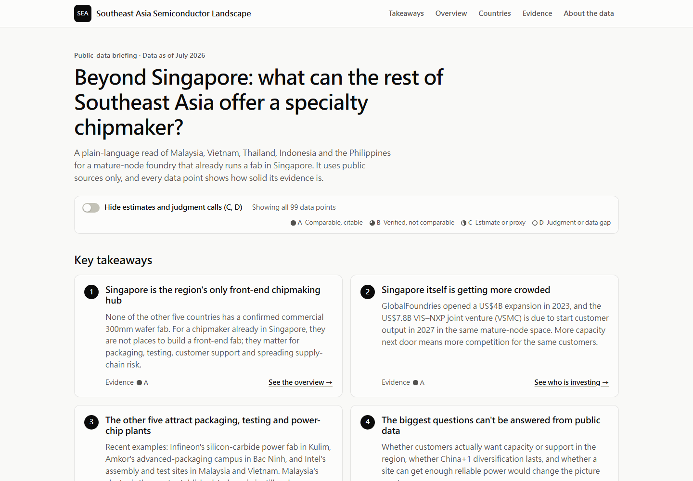
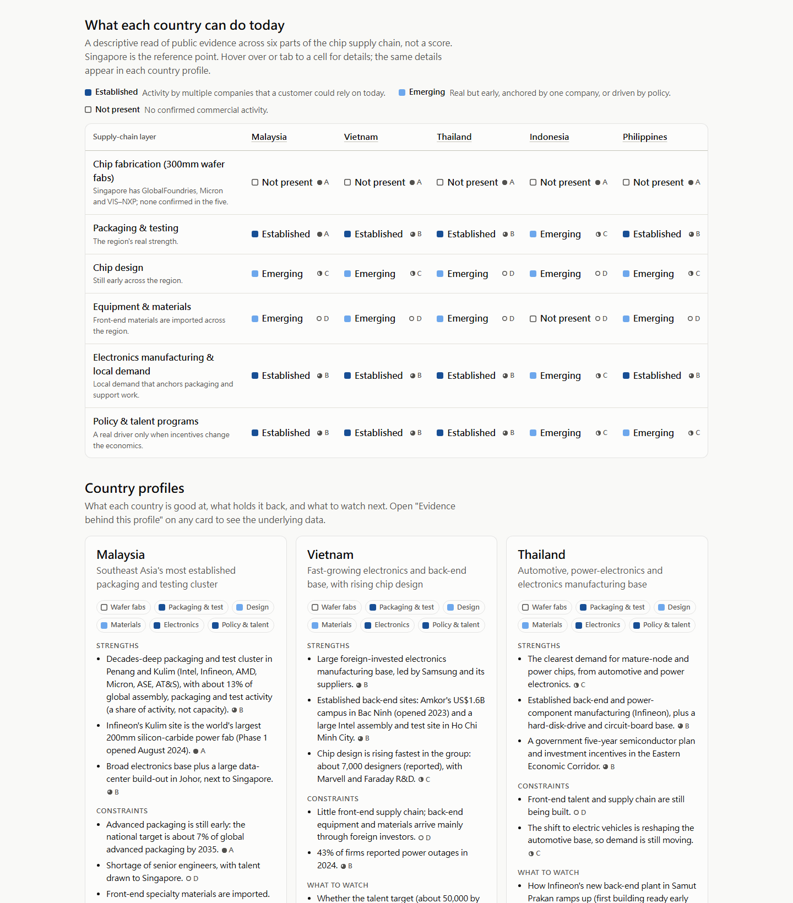

# 01 · Southeast Asia Semiconductor Landscape — Evidence-Graded Dashboard

> A static web dashboard that turns scattered public data on five Southeast Asian semiconductor markets into a plain-language briefing (key takeaways, a country-by-supply-chain overview and country profiles), with an evidence-quality grade on every data point.

| | |
|---|---|
| **Workstream** | Regional strategy |
| **Timeline** | June – July 2026 · four major iterations, then a readability redesign (September 2026) |
| **My role** | Framed the question, researched and verified the data, designed the information architecture, built the dashboard |
| **Tools** | HTML, CSS, vanilla JavaScript, JSON data model · public sources (company releases, government agencies, World Bank / UNESCO UIS, OECD, Reuters) |
| **Included** | [Runnable dashboard](dashboard/README.md) · screenshots: [overview](assets/dashboard_overview.png), [table and profiles](assets/dashboard_matrix_and_profiles.png) |

## The question

A specialty (mature-node) foundry already runs a front-end fab in Singapore. The goal was a clear, honest view of the rest of the region — Malaysia, Vietnam, Thailand, Indonesia and the Philippines — that supports management discussion without turning into a country ranking.

**The question I framed:** *which publicly verifiable facts about Southeast Asia outside Singapore should actually change how a decision-maker judges the region?*

## The structural finding

Public evidence shows that **none of the five countries has a confirmed commercial 300mm front-end wafer fab**. The region's only front-end anchor is Singapore. So the "Southeast Asia outside Singapore" question is not about where to site a front-end fab. It is about **back-end adjacency, reading demand, and China+1 optionality**, and the whole dashboard is organized around that.

## What I built

The page reads top-down, from conclusions to evidence:

| Layer | What it gives the reader |
|---|---|
| Key takeaways | Four plain-language conclusions, each with its evidence grade and a link to the proof |
| Overview | A country × supply-chain table showing where each country is established, emerging or not present across six layers (a descriptive read, not a score) |
| Country profiles | One card per country with its role, strengths, constraints and what to watch; the underlying data is one click away |
| Evidence | Collapsible detail: demand drivers, company investments, practical constraints, real projects vs. announcements, open questions and sources |

**Evidence-quality tags are the spine of the dashboard.** All 99 data points carry one of four tags, and the 24 sources are graded the same way:

| Tag | Meaning | Data points | Sources |
|---|---|:-:|:-:|
| **A** | Comparable, directly citable — source, year and definition are clear | 17 | 15 |
| **B** | Verified but not cross-comparable — definitions differ across countries or years | 28 | 6 |
| **C** | Estimate or proxy | 28 | 3 |
| **D** | Author judgment or public-data gap | 26 | — |

More than half of the data points are C or D. The dashboard shows that openly instead of hiding weak evidence behind a single score: one switch hides grades C and D across the page, leaving 45 data points, so a reader can see at a glance what rests on solid evidence.

Under the hood: eight data files whose items reference sources by ID (resolved against a shared source index), plus a summary file and country profiles written from that data. There is no backend and no build step, so the dashboard runs on any static host.

## How it evolved

The dashboard went through four versions in about three weeks, then a fifth redesign for readability. Two lessons stuck: a decision tool should not manufacture precision, and rigor only helps if a reader can follow it.

| Version | Design | Why it changed |
|---|---|---|
| v1 · mid-June | Weighted scorecard: country × expansion-mode matrix, adjustable scoring lenses, decision funnel | The scores looked decisive, but the weights were subjective and implied false precision |
| v2 · 5 July | Screening & diligence dashboard: objective country metrics, case dossiers, open diligence tracker; scoring removed | Still led with a conclusion instead of supporting the discussion |
| v3 · 7 July | Strategic overview: option map, option-by-evidence matrix, diligence workplan | Still an information overview organized by data category, and missing the demand and competition layers |
| v4 · 9 July | Consultant view: seven modules ordered by decision driver, quality tags on every data point, aligned to a re-verified data appendix | Rigorous, but it led with method rather than conclusions, spread each country across seven modules and relied on consulting jargon |
| **v5 · September** | **Readability redesign (current): key takeaways first, a country × supply-chain overview, country profiles, evidence on demand, and a switch to hide weaker evidence** | — |

The design principle I ended with: move from *raw data → structured information → discussion-ready insight*, not from *raw data → subjective score → artificial recommendation*, and put the conclusion first with the evidence one click away.

## Verifying the data

Before the final version I re-checked the underlying data appendix against original sources and corrected several claims from earlier drafts:

- **Power reliability.** A claim that Malaysia's average outage duration (SAIDI) was under two minutes was wrong; official historical values are in the tens of minutes per customer per year. World Bank *Doing Business* SAIDI figures were relabeled as reference-city values, not national averages.
- **Talent.** A "~600,000 E&E engineers" figure mixed up electronics-industry employment with engineers and was removed. Annual graduates, talent stock, enrollment and policy targets are now kept separate.
- **Share vs. capacity.** Malaysia's "~13%" is framed as a share of global assembly, packaging and test *activity*, not physical capacity.
- **Policy announcements.** For the Arm × Danantara (Indonesia) training agreement, confirmed facts were separated from figures that still need primary-source confirmation.
- **Graduate data.** Shares of graduates in engineering, manufacturing and construction were updated to the latest World Bank / UNESCO UIS values, and missing years are shown as gaps.

## Key takeaways (public data, as of July 2026)

**Value-chain credibility**, with Singapore as the front-end reference point:

| Layer | Malaysia | Vietnam | Thailand | Indonesia | Philippines |
|---|---|---|---|---|---|
| Front-end wafer fab (300mm) | Absent | Absent | Absent | Absent | Absent |
| Back-end / OSAT (packaging & test) | Credible | Credible | Credible | Emerging | Credible |
| IC design | Emerging | Emerging | Emerging | Emerging | Emerging |
| Equipment & materials | Emerging | Emerging | Emerging | Absent | Emerging |
| EMS / electronics demand | Credible | Credible | Credible | Emerging | Credible |
| Policy & talent development | Credible | Credible | Credible | Emerging | Emerging |

- **Front-end competition is a Singapore contest.** Confirmed 300mm additions cluster in Singapore (GlobalFoundries' US$4B expansion; the US$7.8B VIS–NXP mature-node joint venture), which is partly a *crowding* signal for a mature-node foundry.
- **The other five countries attract back-end, OSAT and power-semiconductor investment** (for example Infineon in Kulim, Amkor in Bac Ninh, Intel in Penang and Kulim). They matter as adjacency and optionality, not as front-end sites.
- **The biggest unknowns are not in public data:** actual customer pull, how durable China+1 diversification is, and site-level firm power. The dashboard names them explicitly instead of filling them with scores.

## Skills demonstrated

- Industry and policy research with source-level verification
- Designing an evidence-quality framework and a data model with cross-referenced source IDs
- Information architecture for an executive audience, iterated on stakeholder feedback
- Designing for readability: rebuilt an evidence-heavy dashboard around the reader's questions after comparing versions side by side
- Framework-free front-end development (HTML, CSS, JavaScript) for zero-build static hosting
- Engineering judgment: evaluated migrating to Astro / Tailwind and chose to stay framework-free until the data model stabilized, putting effort into data validation first

## Confidentiality

The dashboard is built only from public sources and contains no company-internal customer, capacity or financial data. Company-specific strategy materials prepared in the same workstream are not included.
