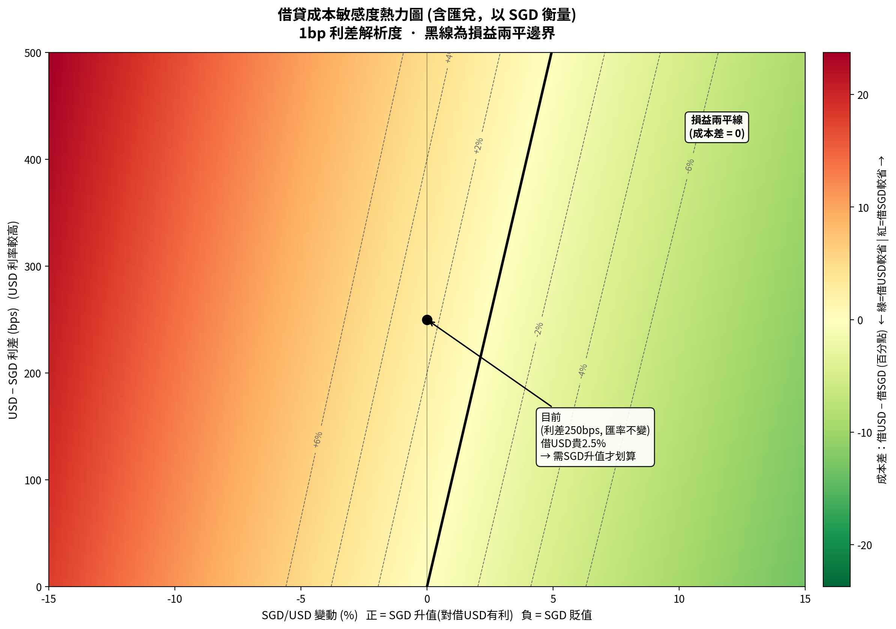

# 03 · Borrowing Cost & FX Sensitivity Models

> Two parameterized Excel models and a heatmap that answer a treasury question: when does borrowing in the lower-rate currency stop being cheaper once exchange-rate moves are included?

| | |
|---|---|
| **Workstream** | Treasury / funding decisions |
| **Timeline** | 2026 |
| **My role** | Built the models and the visualization |
| **Tools** | Formula-driven Excel workbooks with separated inputs and scenario grids · heatmap chart |
| **Included** | [borrowing_cost_sensitivity_model.xlsx](borrowing_cost_sensitivity_model.xlsx) · [fx_rate_sensitivity_model.xlsx](fx_rate_sensitivity_model.xlsx) · [heatmap](fx_borrowing_cost_heatmap.png) (labels in Chinese; explained below) |

## The question

A Singapore entity can borrow in SGD or in USD. Nominal rates differ, but an unhedged USD loan also carries FX risk: if SGD weakens, repaying USD costs more in SGD terms. **For a given rate spread, how far does the exchange rate have to move before the other currency becomes cheaper?**

## Core formulas

SGD as the home currency, one-year tenor:

- All-in cost of a USD loan, measured in SGD = (1 + rUSD) ÷ (1 + ΔSGD) − 1, where ΔSGD is SGD's move against USD (positive = SGD appreciates)
- Cost difference = all-in USD cost − rSGD (negative → USD is cheaper; positive → SGD is cheaper)
- Break-even SGD appreciation = (1 + rUSD) ÷ (1 + rSGD) − 1

## Model 1 · Spread × FX matrix

*`borrowing_cost_sensitivity_model.xlsx`*

**Inputs** (blue cells on the *Assumptions* sheet): SGD borrowing rate, USD–SGD spread in basis points and grid settings, with spot rate and tenor recorded for reference. The matrix is fully formula-driven, so changing the SGD rate or a grid setting recalculates it.

**Analysis sheet:** a 21 × 13 matrix of cost differences — spreads from 0 to 500 bps in 25 bp steps against SGD moves from −15% to +15% in 2.5% steps — plus a break-even column for every spread.

## Model 2 · Both reporting currencies

*`fx_rate_sensitivity_model.xlsx`*

The same decision seen from each side, on the same base case as Model 1, so the two workbooks agree:

- **Scenario sheets:** an SGD-based borrower comparing a USD loan with SGD funding, and a USD-based borrower comparing an SGD loan with USD funding. FX moves run from −10% to +10% in 5% steps; each row shows the all-in cost, the home-currency alternative, the cost difference and the cheaper choice, with the break-even move underneath.
- **Two-way grids:** a parallel rate shock applied to both currencies (−100 to +100 bps in 50 bp steps) against the same FX moves, with the home-currency borrowing cost alongside each row for direct comparison.
- **Inputs:** one *Assumptions* sheet; the SGD rate, the spread and each grid's start and step settings drive every table.

## Reading the result

With the illustrative inputs (SGD at 1.2%, a 250 bp spread, so USD at 3.7%):

- If the exchange rate does not move, borrowing USD costs **2.5 percentage points more**.
- SGD would need to appreciate by about **2.47%** over the year for USD borrowing to break even.
- Seen from a USD-based borrower, SGD funding stays cheaper unless USD depreciates by more than about **2.41%** against SGD.
- The heatmap plots the same surface at 1 bp resolution. The black line is the break-even boundary: to its left (SGD weakening) borrowing SGD is cheaper; to its right (SGD strengthening) borrowing USD is cheaper.

**Caveat built into the model:** these are *unhedged* costs. If the FX exposure is hedged with forwards, covered interest parity means the forward points roughly offset the rate differential, so the choice becomes a hedging-policy question rather than a simple rate comparison.

### Chart and workbook labels

| Chinese label | Meaning |
|---|---|
| 借貸成本敏感度熱力圖（含匯兌，以 SGD 衡量） | Borrowing-cost sensitivity heatmap (FX-inclusive, measured in SGD) |
| USD − SGD 利差 (bps) | USD − SGD rate spread (bps) |
| SGD/USD 變動 (%) | SGD move against USD (%) |
| 損益兩平線 | Break-even line |
| 成本差：借 USD − 借 SGD | Cost difference: borrow USD − borrow SGD |
| 假設 / 敏感度矩陣 | Assumptions / sensitivity matrix |
| FX情境_SGD記帳 / FX情境_USD記帳 | FX scenarios with SGD / USD as the reporting currency |
| 2D敏感度_SGD借USD / 2D敏感度_USD借SGD | Two-way sensitivity: SGD-based borrower taking USD / USD-based borrower taking SGD |
| 全包成本 | All-in cost, including FX |
| 利率衝擊 | Parallel rate shock |
| 較優選擇 | Cheaper option |

## Skills demonstrated

- Financial modeling with clean input/formula separation and parameterized scenario grids
- FX risk and funding-currency analysis; break-even reasoning
- Framing one funding decision from both reporting currencies
- Communicating a two-variable sensitivity visually

## Confidentiality

All inputs are illustrative, market-level assumptions, not company borrowing terms.
